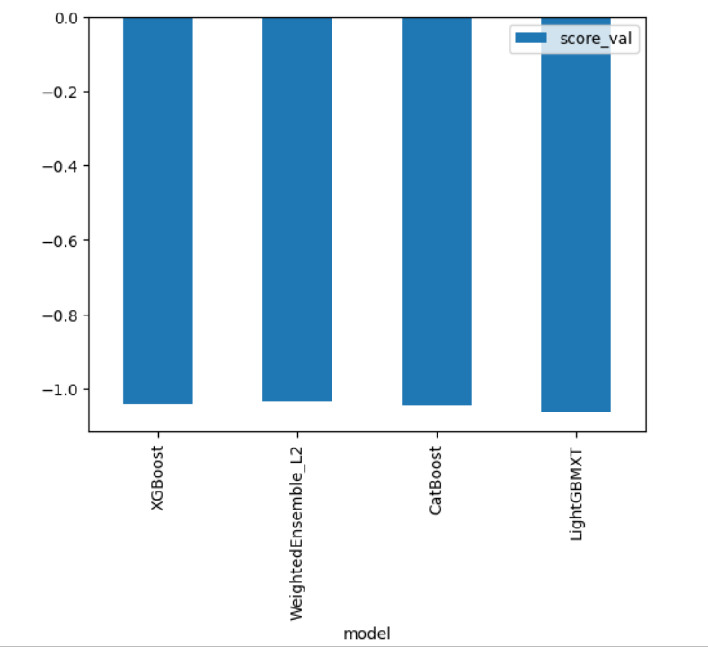
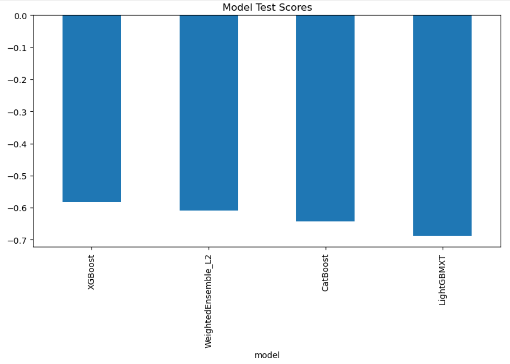

# Report: Predict Bike Sharing Demand with AutoGluon Solution
#### Sama Yousef

## Initial Training
### What did you realize when you tried to submit your predictions? What changes were needed to the output of the predictor to submit your results?
The first attempt produced an output with float values. To match the required format on Kaggle, I had to convert the predictions to integer values. This was done using `.round().astype(int)` before saving the submission file.

### What was the top ranked model that performed?
In the initial run, AutoGluon selected `LightGBM` as the top-performing model.

## Exploratory data analysis and feature creation
### What did the exploratory analysis find and how did you add additional features?
AutoGluon automatically extracted datetime features (like hour, weekday, etc.) from the "datetime" column. I did not add any manual features since the default AutoGluon preprocessing handled most of the relevant feature engineering.
Additionally, I removed columns such as `casual` and `registered` from the training set since they do not exist in the test set and would cause data leakage if used.

### How much better did your model preform after adding additional features and why do you think that is?
There was no manual feature engineering added beyond the automated datetime extraction. The score improved after increasing training time, not due to feature changes.

## Hyper parameter tuning
### How much better did your model preform after trying different hyper parameters?
I increased the `time_limit` in the AutoGluon fit call to allow longer training. This improved the model performance significantly. The private Kaggle score improved from `1.89684` to `1.28297`.

### If you were given more time with this dataset, where do you think you would spend more time?
I would try manual feature engineering like grouping working days, temperature ranges, or user category patterns. I would also explore advanced ensembling and possibly try more aggressive hyperparameter tuning for `LightGBM` and `CatBoost`.

### Create a table with the models you ran, the hyperparameters modified, and the kaggle score.
|model|hpo1|hpo2|hpo3|score|
|--|--|--|--|--|
|initial|default|default|default|1.89684|
|increased training time|time_limit=600|default|default|1.28297|

### Create a line plot showing the top model score for the three (or more) training runs during the project.

### Create a line plot showing the top kaggle score for the three (or more) prediction submissions during the project.

## Summary
I used AutoGluon to build a bike demand forecasting model. Initially, the predictions were in float format, so I had to round them before submission. AutoGluon handled most of the feature engineering automatically, including extracting datetime features. The top-performing model in the first attempt was `LightGBM`, and performance significantly improved after increasing the training time limit from the default to 300 seconds. With more time, I would explore manual feature engineering and more refined hyperparameter tuning.
